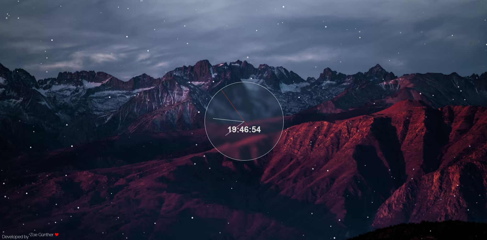

# Analogue clock (fun project)

This website is written in HTML, CSS and JS. The library [ParticleJS](https://vincentgarreau.com/particles.js/) is used for the background particles.

## Installation

You just need to download this project. You can open the index.html locally on your computer or upload the website files to a webserver.
